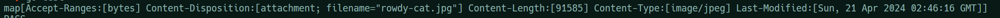

# April 17 Notes

## Go workspaces

- `go work init [folders]` adds folders to the workspaces so that it's easy to manage imports
- `go work use [folder]` to add a folder after initialization

## UploadFile

- `hdr` represents a single file header within the multipart form data received from an HTTP request.

## io.Pipe()

```golang
func main() {
 fmt.Println("Hello, 世界")
 r, w := io.Pipe()
 go func() {
  defer w.Close()
  time.Sleep(2 * time.Second)
  fmt.Fprint(w, "HELLLOOO WORLD\n")
 }()
 fmt.Println("WOOOHOOOO")
 _, err := io.Copy(os.Stdout, r)
 if err != nil {
  fmt.Println("ERROR")
 }
 fmt.Println("BYEE")

}
```

- The code is blocked till r gets an input. It almost works as a channel.
- r can work as a `Reader` and w can work as a `Writer`

## What exactly is happening in Test

### High Level

- A mock request is created with the exact specifications that will come from the actual api.
- This request is passed to our function to see whether it's behaving appropriately

### Low Level

- `pr, pw` is created as pipe.
- `writer` is created of type `multiform.Writer` using pw. ( Basically its functions will make pw write to pr )
- `part` is created of type `io.Writer` using `CreateFormFile`. This takes the information to generate a file path. Note that this does not take the actual image just the path.
- We get the image using os.Open and then decode it using `image.Decode`. Later we call the `encode` function to write the encoded image to `part`
- `part` internally writes to `pw` so that a proper request data (of multiform file type) was sent to pr.
- Using this we create a mock request using `httptest`  

## Use of waitgroups

- The `wg.Add(1)` call increments the wait group counter by 1, indicating that there is one goroutine that needs to complete its task before the main test function can proceed.

- Inside the goroutine, `wg.Done()` is called when the goroutine has finished its task. This decrements the wait group counter by 1.

- Finally, `wg.Wait()` is called at the end of the loop. This blocks the main test function until the wait group counter becomes zero, indicating that all goroutines have completed their tasks.

- In this specific context, the wait group ensures that the writing goroutine (which writes the image data to the pipe) completes its task before the main test function proceeds to interact with the HTTP request and check the result of the file upload. Without the wait group, there would be a risk of the main test function proceeding before the image data is fully written to the pipe, leading to incomplete or erroneous test results.

## Regex

```golang
slug := strings.Trim(re.ReplaceAllString(strings.ToLower(s), "-"), "-")
```

- `ReplaceAllString` replaces all the characters not matching the format to `-`, then `Trim` is used to removed the leading `-`s.

## File Download

```golang
http.ServeFile(w, r, fp)
```

- `ServeFile` writes the file at the given file path in the server to the response body with the respective header of the filetype
- The header `Content-Disposition` is used to tell the browser how to handle the file in the response - `inline` or `attachment`. Attachment means it will be downloaded.
- In Typescript and express, this is directly handled by res.download.
- If we dont add the `Content-Disposition` header, the browser will automatically try to handle it and mostly display images in the browser itself.



- This is what goes as headers for the particular request

## Struct tags

```golang
type Teacher struct {
    ID     string   `json:"id"`
    Name   string   `json:"name"`
    Domains []string `json:"domains"`
}
```

- tags can be provided to struct fields for better "marshalling" of data to certain formats like JSON.
- These tags can be extracted in the following way -

```golang
func main() {
    teach := Teacher{}
    st := reflect.TypeOf(teach)
    for i := 0; i < st.NumField(); i++ {
        field := st.Field(i)
        fmt.Println(field.Tag.Get("json"))
    }
}
```

## ReadJSON

```golang
 r.Body = http.MaxBytesReader(w, r.Body, int64(maxBytes))
 dec := json.NewDecoder(r.Body)

 if !t.AllowUnknownFields {
  dec.DisallowUnknownFields()
 }

 err := dec.Decode(data)
```

- `MaxBytesReader` is set as `r.Body`. So basically when `dec.Decode()` is called, `r.Body.Read()` is called as well and it throws an error `"http: request body too large"` if it the size is more than `maxBytes`
- If `dec.DisallowUnknownFields()` is executed and during decoding we get any unknown field from `r.Body`, it throws the error `"json: unknown field"`

## WriteJSON

- `json.Marshal` is used to convert go data type to JSON-encoded byte slice, which in turn gets converted to JSON by `w.Write`
- `json.NewEncoder().Encode()` can be used if the data does not need to be stored in-memory or we dont need to make further modifications to it.
- `errors.New()` and `fmt.Errorf()` fulfill the same purpose of generating customized errors where `errors.New` is used to generate static messages and `fmt.Errorf` is used to generate custom error message

## PostJSONToRemote

```golang

 request, err := http.NewRequest("POST", uri, bytes.NewBuffer(jsonData))
 if err != nil {
  return nil, 0, err
 }
 request.Header.Set("Content-Type", "application/json")

 response, err := httpClient.Do(request)
 if err != nil {
  return nil, 0, err
 }
```

- Basically, we create a `http.Request` first and then pass it to the `Do` function of httpClient (`http.Client`) to get a `http.Response` back.
- Also, point to note, if the return values have been named for a function, we can assign values to them and do a naked return.
- The `http.RoundTripper` interface is used to make HTTP requests and is implemented by the http.Transport type, among others.
- It implements the `Roundtrip` function

## How do receiver functions work for function type

```golang
// Define a function type
type StringFunc func(s string) string

// Define a method on the function type
func (f StringFunc) AddExclamation(s string) (string, error) {
    return f(s) + "!", nil
}

func main() {
    // Define a variable of the function type and assign a function to it
    var myFunc StringFunc = func(s string) string {
        return s + " processed"
    }

    // Call the function directly
    result := myFunc("Hello")
    fmt.Println(result)  // Output: Hello processed

    // Call the method on the function type
    resultWithMethod, err := myFunc.AddExclamation("Hello")
    if err != nil {
        fmt.Println("Error:", err)
        return
    }
    fmt.Println(resultWithMethod)  // Output: Hello processed!
}
```

- Go through this to understand how exactly this works. It's quite tricky.
